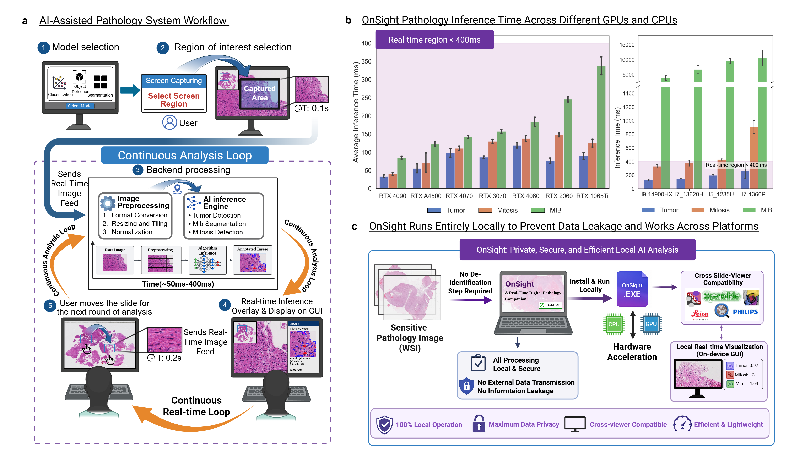

# 🔬 OnSight Pathology – Local Development and Build Guide

<p align="center">
  
</p>

<p align="center">
  <a href="https://onsightpathology.github.io/"></a>
  
  
  
  
</p>

> 📚 **Documentation & Downloads**  
> For full documentation, publication details, and pre-built executables, please visit our official website: **[onsightpathology.github.io](https://onsightpathology.github.io/)**

This document describes how to run OnSight Pathology locally, how to build the application from source, and where to find model training pipelines.


---

## 💻 System Requirements

OnSight Pathology is designed to be cross-platform. 

-  **Windows:** Fully tested and validated (Default).
-  **macOS:** Supported for both Intel and Apple Silicon (Please see the `mac` branch).
-  **Linux:** Beta support available for the GPU version (Please see the `linux` branch).
-  **Python:** `3.11.9` (recommended).
-  **Hardware (Optional):** NVIDIA GPU with CUDA support (for GPU build).

---

This document describes how to run OnSight Pathology locally, how to build the application from source, and where to find model training pipelines.


# Running Locally (Development Mode)

## 1. Create a Virtual Environment

```bash
python -m venv onsight_env
onsight_env\Scripts\activate
```

Confirm Python version:

```bash
python --version
```

Recommended: Python 3.11.9

---

## 2. Install Dependencies

Two dependency files are provided:

| File | Description |
|------|------------|
| `requirements.txt` | GPU version (includes CUDA-enabled PyTorch) |
| `requirements_cpu.txt` | CPU-only version |

Install the appropriate version:

GPU:

```bash
pip install -r requirements.txt
```

CPU:

```bash
pip install -r requirements_cpu.txt
```

---

## 3. Launch the Application

```bash
python app.py
```

This launches the PyQt6 desktop application.

No special configuration is required when running directly via Python.

---

# Building the Executable (PyInstaller)

Ensure PyInstaller is installed:

```bash
pip install pyinstaller
```

Two executables must be built:

- Main application (`app.exe`)
- Worker process (`llm_worker_process.exe`)

---

## GPU Build (Default)

```bash
pyinstaller app.spec --noconfirm
pyinstaller llm_worker_process.spec --noconfirm
```

---

## CPU Build

For CPU-only builds, set the `BUILD_TYPE` environment variable to `CPU` before running PyInstaller.

This prevents PyTorch from initializing or probing CUDA devices, avoiding CUDA DLL discovery behavior that can cause crashes on systems without GPU drivers.

### PowerShell

```powershell
$env:BUILD_TYPE="CPU"
pyinstaller app.spec --noconfirm
pyinstaller llm_worker_process.spec --noconfirm
```

### Command Prompt (cmd)

```cmd
set BUILD_TYPE=CPU
pyinstaller app.spec --noconfirm
pyinstaller llm_worker_process.spec --noconfirm
```

---

## Post-Build Directory Structure

After building:

```
dist/
    app/
    llm_worker_process/
```

Before running `app.exe`, move only:

```
dist/llm_worker_process/llm_worker_process.exe
```

into:

```
dist/app/
```

Do **not** move the `_internal` folder from `llm_worker_process/`.

All required libraries and dependencies are already bundled within:

```
dist/app/_internal/
```

Final structure:

```
dist/
    app/
        app.exe
        llm_worker_process.exe
        _internal/
```

The main application expects the worker executable to reside in the same directory.

---

# Creating a Windows Installer (Inno Setup)

OnSight Pathology can be packaged using Inno Setup version 6.5 or newer.

Download:

https://jrsoftware.org/isdl.php

As of Inno Setup 6.5, the maximum installer size is 4GB. Disk spanning is not required.

---

## Building the Installer

A single installer script is provided:

```
installer.iss
```

The script expects the `dist/` directory to exist.

To generate the installer:

1. Open `installer.iss` in Inno Setup.
2. Click **Run**.

The compiled installer will be generated in:

```
Output/
```

No modification to the `.iss` file is required.

---

# Training Pipelines

The repository includes a:

```
training/
```

directory containing scripts used to train the models bundled with OnSight Pathology.

Each model has its own subdirectory within `training/` that contains:

- Data preparation scripts
- Dataset conversion utilities
- Training configuration files
- Training scripts
- Model-specific documentation

Detailed instructions for reproducing model training can be found in the respective `README.md` files within each model’s training directory.

These materials are provided for transparency and reproducibility.

---

# Adding New Models

To integrate additional models into OnSight Pathology:

1. Add a metadata JSON file to: `metadata/`

2. Update `settings.py` to add a dropdown entry referencing the metadata file.

3. Modify `utils.py` to define how the model is initialized and loaded when selected.

4. Create a `process_region.py` file to define how the model performs inference on captured screen frames and how outputs are structured.

Existing model implementations may be used as references.

---
# Acknowledgements

The project was built on top of amazing repositories such as MIDOGpp and CellViT. We thank the authors and developers for their contribution.
---
⚠️ Windows Users — First-Time Setup

If OnSight fails to download models with errors poping up on first launch, Windows Defender/Firewall may be blocking the download. Please follow the steps below:

1. Right-click the OnSightPathology.exe and select "Run as administrator"
2. When the terminal window appears, press Enter to begin

Models will download automatically. This is only required on the first launch.
---

# Citation

If you use OnSight Pathology in research, please cite the associated publication listed at:

https://onsightpathology.github.io/
